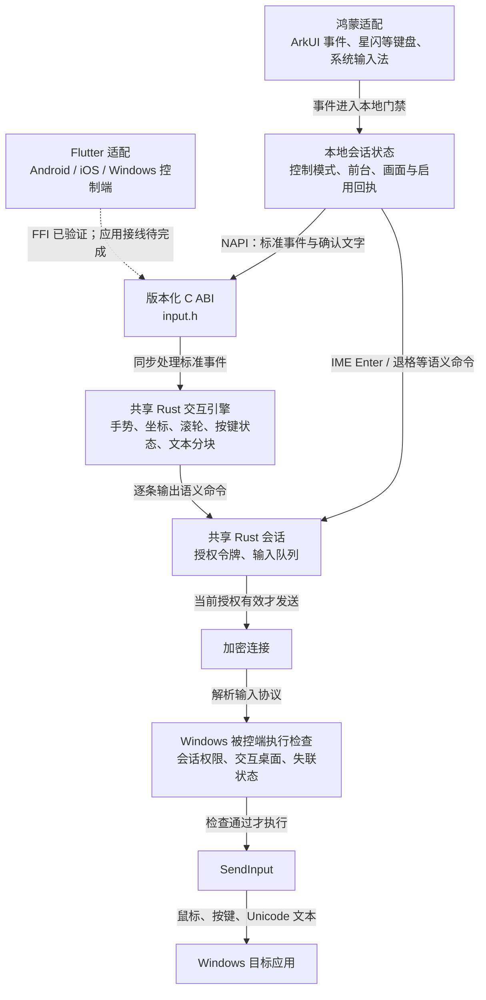
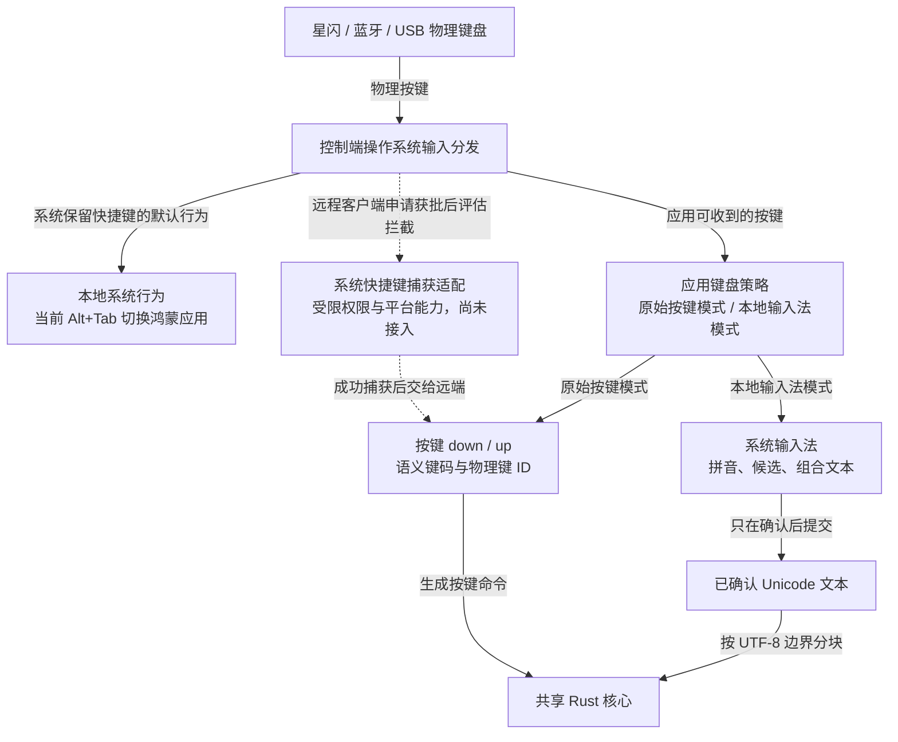

# 控制输入流向

此图描述当前跨平台输入分层。鸿蒙已接入共享 Rust；Flutter 的 FFI 与事件适配已在 Windows 使用真实 DLL 验证，完整客户端 UI、Android/iOS 原生打包仍待后续。

画布输入增量：未缩放 viewport 采集坐标 → `canvas.h` 共享变换与手势判定 → 本地缩放/平移状态回传 UI，或生成远端语义命令进入原会话授权。系统安全区和应用工具栏只作为 configure 数据，不在各平台重复手势算法。仅查看允许本地画布操作；Flutter 新增同 ABI 的 CanvasView。详见 [SPEC-005](specs/005-touch-display-and-gestures.md) 与 [交付记录](research/2026-10-08-canvas-completion.md)。

## 已实现的主链路

平台适配只处理操作系统事件和输入法。共享引擎不持有窗口、UI 对象或授权令牌；每条命令还必须通过会话授权及被控端执行检查。输入法 Enter/退格等已经是语义命令，可以直接进入同一个严格会话队列，不能绕过授权。

## 键盘策略与系统拦截边界

下图区分系统保留快捷键和应用可收到的输入。原始按键已接入 pre-IME，文本模式交给系统输入法；系统捕获适配仍未接入，不代表当前 HAP 已可捕获 Alt+Tab。

原始按键模式把应用收到的 down/up 发往远端，由远端输入法处理；本地输入法模式先由控制端完成组词，只把已确认文字发送给远端，同一个字符不能同时走两条通道。失焦、模式切换和断开必须释放已按下的修饰键。

用户报告 Alt+Tab 触发鸿蒙应用切换。官方已明确它是禁止普通组件绑定的系统组合键，不能仅靠 Windows 键码映射或 onKeyEvent 返回 true 修复。面向远程客户端可评估 API12 原生 interceptor，但需要 INTERCEPT_INPUT_EVENT 受限权限、签名 ACL 与实机验证。详见 [键盘与权限核查](research/2026-10-07-harmony-keyboard-routing.md)。

实现与平台范围见 [SPEC-004](specs/004-cross-platform-input.md)。可维护源图为 [主链路](diagrams/control-input-flow.mmd) 和 [键盘策略](diagrams/keyboard-routing.mmd)。
