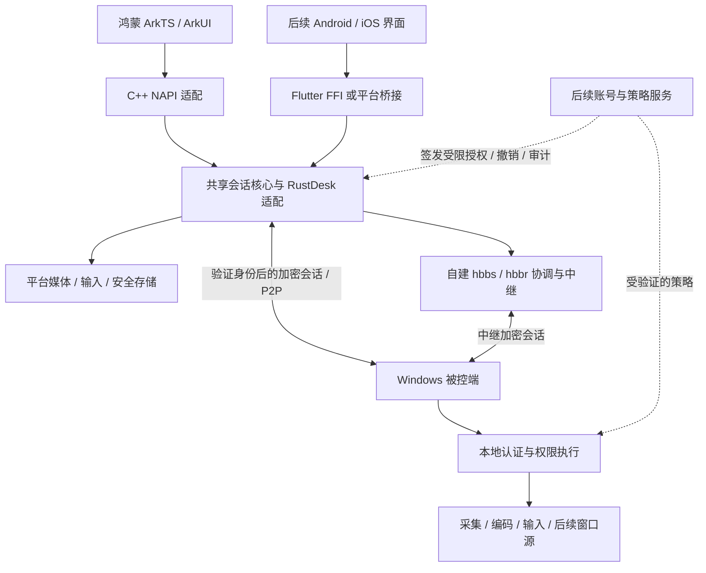
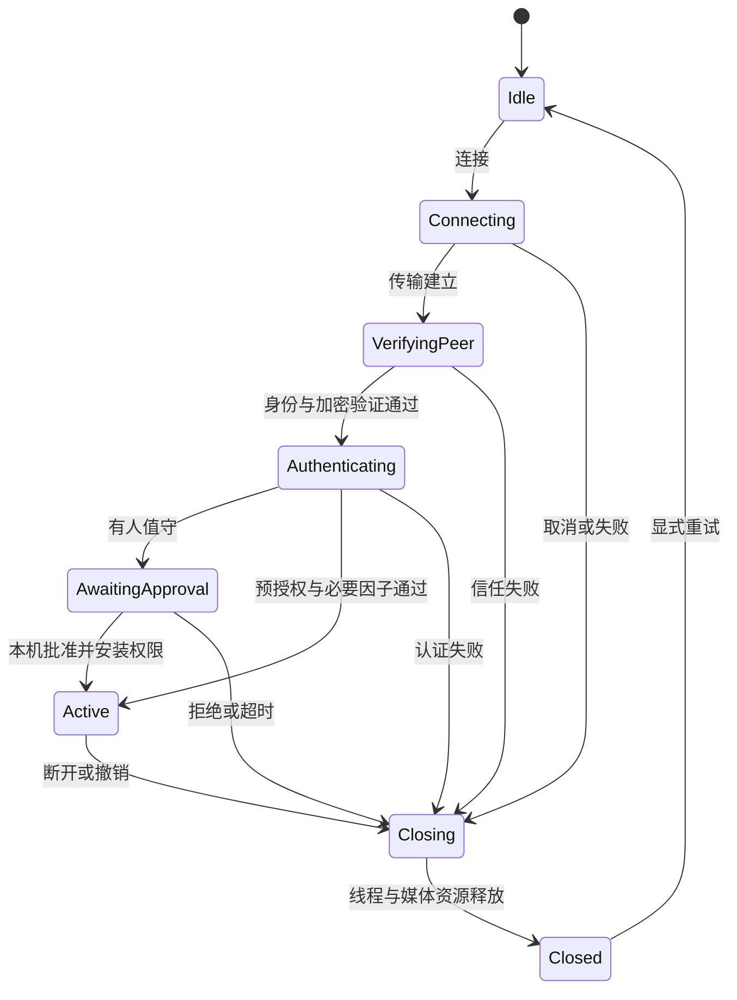

# 产品需求与架构设计

版本：0.2 · 日期：2026-09-30 · 状态：可评审草案，尚未实施或通过公网安全验收。

本文是产品范围、被控端改造、安全模型与控制端架构的主规格。阶段进度只在 [PROGRESS.md](PROGRESS.md) 维护，阶段顺序见 [ROADMAP.md](ROADMAP.md)。

## 1. 目标与设计前提

基于用户 fork 的官方 RustDesk，提供类似 ToDesk 的设备 ID 连接和当前桌面协助，优先改善鸿蒙手机/平板操作体验。在可验证的认证、授权和加密条件下使用公网协调/中继，后续增加省流、应用窗口模式和多协议控制。

已确认：Windows 被控端优先；鸿蒙控制端优先；已有鸿蒙 6.1 真机和开发环境；Android/iOS 控制端、macOS 被控端后续补齐；自己的被控端以一种协议为主，控制端未来可支持多协议。

以下为本稿默认假设，不替用户作最终商业或访问策略决定：

| 项目 | 本稿采用的设计 | 调整影响 |
| --- | --- | --- |
| 使用范围 | 个人及少量可信用户自建 | 团队/公开服务需增加账号、租户、设备归属、配额和中心授权系统，不能只部署 hbbs/hbbr |
| 访问方式 | 临时协助必须现场确认；自己的设备可显式启用预授权无人值守 | 未完成可信控制设备绑定及撤销机制前，仅交付有人值守模式 |
| 许可路线 | 复用官方核心按 AGPL 义务规划；不承诺闭源控制端 | 若闭源成为硬约束，暂停引入 AGPL 实现，另行评估独立实现或其他授权 |
| 公网策略 | 自建服务器和信任配置；身份校验/加密失败即拒绝 | 不接受仅告警后继续，不用非安全路径提高连接成功率 |

### 范围与优先级

| 编号 | 需求 | 交付阶段 |
| --- | --- | --- |
| REQ-001 | 鸿蒙 6.1 手机/平板原生控制 Windows 当前桌面 | M0/M1 |
| REQ-002 | 设备 ID、现场授权、自建协调和中继；直连与中继明确区分 | M1 |
| REQ-003 | 触控板/直接触控、右键拖拽、缩放、中文输入和快捷键 | M2 |
| REQ-004 | 静止少传、变化增量压缩、按网络调质量 | M3，先测官方已有能力 |
| REQ-005 | 指定应用窗口采集与输入范围限制 | M4 |
| REQ-006 | 控制端后续接入 RDP/VNC/Moonlight 等 | M5，每次增加一个协议 |
| REQ-007 | Android/iOS 控制端、macOS 被控端 | M5 |
| REQ-008 | 未来 HarmonyOS PC 被控端 | 独立可行性研究，不承诺输入注入与无人值守 |
| REQ-009 | 认证、授权和连接加密在可信端执行 | 公网试用前必须完成 |
| REQ-010 | 需求、决策、进度、验证证据进入 Git | 已建立文档体系 |
| REQ-011 | 默认最小权限、动态撤权、危险通道拒绝 | M1 |
| REQ-012 | 可信控制设备绑定、无人值守、信任撤销 | M2 的独立安全增量，未完成前不开放 |
| REQ-013 | 公网部署加固、限流、审计、更新和密钥生命周期 | M1 起逐阶段验收 |
| REQ-014 | 共享会话核心、版本化桥接、平台媒体与系统适配 | M0/M1，M5 验证第二平台 |

首个公网版本只开放单显示器查看与经现场批准的键鼠；受控文本剪贴板和系统音频是后续可选能力。文件传输、终端、隧道、摄像头、远程打印、隐私模式和管理员提权不随“能连接”自动开放。

## 2. 当前代码能复用什么

源码基线：`a7f2260203befb7e9c70b585219f0f0b5ca57703`；本次调查时 HEAD：`15679d88a`（额外提交为项目文档）。GitNexus 只作定位，结论以当前源码核对为准，没有运行真机构建或完整安全审计。

| 能力 | 当前事实 | 本产品的处理 |
| --- | --- | --- |
| 认证 | 已有临时/永久密码、现场批准、TOTP、可信设备、失败节流 | 复用实现，重新约束组合语义；已有 Both 不是“密码且现场确认” |
| 连接加密 | 已有公钥签名、会话加密和部分通道绑定；仍有非安全兼容路径 | 新增严格准入门禁，在认证前拒绝未验证/未加密会话 |
| 操作权限 | 被控端已有键鼠、剪贴板、文件等检查 | 在已有执行点增加产品权限交集、撤权和独立提权控制 |
| 白名单 | 已有 IP/CIDR 和 ID 过滤；ID 为对端自报 | 只能作附加过滤，不能替代可信身份 |
| 省流 | 已有新帧检测、相等帧过滤、独立光标服务、VideoQoS | 先测目标采集/编码路径，避免重复实现 |
| 窗口模式 | 当前视频源分派主要是 Monitor/Camera | 后续增加独立窗口源及输入范围策略 |
| 控制端复用 | 已有 Client::start、Session<T> 和 UI 回调接口 | 用薄桥接接入，不能将其视为现成跨平台 SDK |
| 鸿蒙支持 | 现有 Cargo/cfg 多处以非 Android/iOS 判断桌面依赖 | 明确 controller-only/OHOS 平台适配，不能冒充 Linux/Android |
| 多协议 | 现有 RDP 路径含转发后调用 RDP 的行为 | 不等于内置通用 FreeRDP 多协议核心；后续单独适配 |
| 管理平台 | 客户端有 API 权限/审计钩子 | 不能推定开源 hbbs/hbbr 已提供完整账号、RBAC 和审计后台 |

完整源码证据见 [认证与权限调查](research/2026-09-30-auth-permissions-audit.md) 和 [控制端可移植性调查](research/2026-09-30-controller-portability-audit.md)。

## 3. 整体架构与信任关系

### 三种平面

- 连接平面：hbbs 负责发现/协调，hbbr 负责中继；连接成功不代表有权查看或操作。
- 授权平面：首期以被控端本地策略、认证与现场批准为准；后续中心服务只能给出受验证且受本机安全上限约束的授权。
- 数据平面：视频、输入及以后开放的数据通道均受会话权限约束；直连与中继执行相同安全要求。

设备 ID 是寻址标识；显示名称是提示信息；可信身份必须来自经过验证的密钥证明或受信的认证凭据。公网中继可以看见部分连接元数据，不能因为采用端到端加密就宣称服务器看不到任何信息。

首期不要求建设多租户账号平台。若以后采用登录账号，必须新增设备归属、邀请、角色、短期授权、撤销和审计，不把“登录控制端账号”直接等同于“获准控制所有设备”。

## 4. 被控端安全模型

### 4.1 默认状态

首次安装状态为“未启用远程访问”。由本机授权用户选择自建服务和信任公钥，启用“有人值守协助”。不自动生成长期公网控制权，不把运行服务或知道设备 ID 当作授权。

新增产品策略只作用于本产品构建/已启用产品配置的路径，尽量保留上游默认代码以便跟进更新；但本产品发布包必须启用强制策略，不能允许普通远端用户关闭策略或切换到宽松上游路径。

### 4.2 身份和会话准入

所有会话先经历：建立网络连接 → 校验信任根和被控端身份 → 建立已认证加密通道 → 认证控制方/获得现场批准 → 安装权限快照 → 允许画面与操作。

- 控制端固定自建服务的验证公钥；首次配置通过本机输入或受信配置包完成，不从未认证对端自动接受替换密钥。
- 已绑定被控设备的公钥变化必须重新核对；服务端验证公钥只是公有信任材料，不能当作访问密码。
- 身份缺失、签名不符、会话未加密、身份与连接通道绑定失败时立即拒绝。不得回退到 non-secure 后继续发口令、画面或输入。
- 被控端同样拒绝未满足加密和认证要求的会话，不能只靠本产品控制端自律。官方/第三方客户端是否兼容以安全能力为准。
- 直连、UDP、WebRTC、中继切换不得绕过验证；重新建立会话或改变对端身份时必须重新授权。
- 会话取消、错误、密钥过期均清理输入状态、媒体队列及权限；失败不得保留上一轮授权。

### 4.3 有人值守与无人值守

**有人值守：** 本机用户开启限时协助，控制方使用短时协助凭据并请求范围；被控端展示请求来源、已验证状态、请求权限和连接路径。必须本机批准才能发送画面或接收操作。拒绝/超时即结束。

初始产品默认值：协助邀请有效 10 分钟、单次使用；批准等待 60 秒；会话最长 60 分钟，可由本机用户续期。短口令必须依赖现有认证协议、失败节流和现场确认；它不是可长期复用的强凭据。具体临时凭据生成、验证、轮换复用上游经过核实的路径。

现有 ApproveMode::Both 是替代授权路径，不是两个条件同时成立。本产品“凭据验证且现场批准”的策略需显式实现并覆盖所有授权分支。

**无人值守：** 单独启用，仅面向本机用户登记的可信控制设备。要求唯一、强随机的设备访问凭据、绑定后的控制设备身份验证、限定能力和可撤销授权；第二因子策略单独配置，不继承现场批准、记住设备或旧会话复用所带来的隐式豁免。

可信控制设备使用标准密码库的密钥持有证明，经现场登记绑定，不能只匹配 my_id/hwid/名称。M0/M1 要核对官方握手是否提供足够的控制方身份绑定；不足时作为独立、经评审的协议能力增量实现，不自行设计密码算法。该能力及撤销未通过验收时，产品只开放有人值守。

登记材料要绑定目标设备、控制设备公钥、用途、有效期和一次性状态；认证证明要防止跨设备、跨会话重放。具体字段和编码在无人值守阶段的专项规格确定，未完成不能对外标记“支持可信设备无人值守”。

无人值守默认 15 分钟无输入断开、最长 8 小时；本机可缩短。终端用户明确开始长任务时可选择延长，但不能静默无限期维持授权。睡眠恢复、网络切换不复用失效凭据。

### 4.4 权限矩阵

以下为产品权限设计，不是现有协议已全部支持的字段。`控制→被控` 指上传/写入被控端；反向指下载/读取。

| 能力 | 首版默认 | 允许方式 / 执行点 |
| --- | --- | --- |
| 查看当前桌面 | 未批准前禁止 | 会话获批后订阅画面；断开/撤销时停止输出 |
| 键鼠/触控/文本输入 | 禁止 | 本次明确勾选“允许操作”；在被控消息处理前检查 |
| 文本剪贴板：控制→被控 | 关闭 | 后续独立授权，长度限制与回环保护 |
| 文本剪贴板：被控→控制 | 关闭 | 后续独立授权，避免自动泄露本地复制内容 |
| 系统声音 | 关闭 | 后续独立授权，不默认开放麦克风 |
| 文件上传/下载/删除 | 关闭 | 后续拆方向、操作及目录范围；所有独立文件连接同样检查 |
| 请求管理员提权 | 关闭 | 拒绝协议提权请求和服务代执行；不与键鼠权限等价，也不代表完整桌面操作被沙箱隔离 |
| 修改安全配置/信任/服务器 | 远程协议禁止 | 产品设置写入前断开远控、暂停新会话，并要求独立的本机 OS 身份验证；不能仅用“本地 UI”区分远端注入操作 |
| 终端、TCP 隧道、RDP 转发 | 关闭 | 本版拒绝创建对应会话或子通道 |
| 摄像头、文件剪贴板、远程打印 | 关闭 | 首版拒绝相关协议入口和订阅 |
| 重启、隐私屏、阻止本机输入 | 关闭 | 后续专项授权；本机一键断开始终优先 |
| 录屏/截图 | 内置功能关闭 | 无法防止已获画面的控制者用外部设备或软件保存；不承诺防截屏 |

有效权限 = 本机安全上限 ∩ 经认证身份可用权限 ∩ 本次批准/有效预授权 ∩ 本次请求范围。未显式授予即拒绝；未知操作默认拒绝。现有 ControlPermissions 优先级不完全等同该交集，需要改造而不能仅增加 UI 开关。

界面可见能力 = 本地已实现能力 ∩ 对端协议能力 ∩ 被控端已授予权限。界面仅负责表达状态，真正执行点是被控端。

### 4.5 动态撤权与隔离

权限快照带版本；每次操作前检查最新授权，排队输入在执行前再次受约束。撤销键鼠后释放已按下的键/按钮；撤销画面后停止捕获订阅；后续文件/隧道撤权要关闭任务和子通道，而不只影响下次连接。

本机点“断开”立即停输入和媒体，终止会话并记录。目标：收到撤销请求后 1 秒内停止被控端相关行为；不声称能收回已发送的数据。网络故障无法确认中心撤销时按短期授权过期关闭高权限通道。

首版同一 Windows 交互桌面只允许一个活动控制会话，额外会话拒绝或由本机显式替换，避免键鼠竞争。服务进程只保留必要特权，普通 UI 不应通过无校验 IPC 改策略。Windows UAC、安全桌面、锁屏/登录和安装服务分别验收，不承诺都能远程自动处理。

键鼠控制意味着能执行当前桌面用户允许的操作，包括打开终端应用；关闭终端协议通道不等于禁止打开终端，关闭 ElevationRequest 不等于限制所有 GUI 提权。首期安全桌面、锁屏/登录默认暂停输入及相关采集，不能沿用高权限服务能力自动穿透；恢复要重新检查授权。需要限制被协助用户能运行哪些应用时，应使用受限 OS 账户/策略或隔离环境，超出本期。

产品安全设置使用专用受保护操作：开始更改前停止会话、清输入队列并拒绝新连接，经过独立本机身份验证后才修改；结束后重新建立远控，不继承旧授权。该机制需验证，不能仅凭界面位于被控电脑就宣称现场操作。已通过合法桌面控制取得当前 OS 用户执行能力后的任意系统行为，不属于产品按钮级权限能全面隔离的范围。

## 5. 公网部署与运行安全

### 默认拓扑

Windows 主动连接自建服务，保留经过认证的协调式 P2P，并在失败时走中继。默认关闭裸 IP 固定监听、自动 LAN 发现及端口转发功能；关闭 direct-server 不等于关闭由服务器协调的 NAT 打洞。

首期不在路由器上把 Windows RDP、VNC 或 RustDesk 直接访问端口映射到公网。以后 LAN/EasyTier 模式需显式开启并通过同一认证授权；网络组通不等于已授权。

### 发布前要求

| 类别 | 具体要求 |
| --- | --- |
| 端口 | 只开放所选 hbbs/hbbr 版本必需端口；部署文档固定镜像/版本和实际监听清单。不因“远控需要网络”开放全部端口 |
| 管理入口 | SSH/管理面仅允许管理网络、VPN 或明确来源；没有使用的 Web 管理入口不部署 |
| TLS | 如部署配置/账号/API/更新服务，使用 HTTPS 并验证证书；远控数据继续使用自己的端到端认证加密，不能把反向代理 TLS 当成替代品 |
| 中继滥用 | 验证选定 OSS 版本的中继准入和认证能力；配置连接数、带宽、流量告警。验证公钥不等于中继访问令牌；无法限制滥用时不能宣称服务为私有 |
| 限流 | 复用已有失败节流和未认证连接限额；覆盖 IPv4/IPv6、中继、多来源、重复确认提示；不能只按中继服务器 IP 粗暴封禁所有用户 |
| 密钥 | 服务私钥、设备私钥、TOTP secret 和访问凭据均不进 Git/日志/普通偏好文件；备份加密并限制访问，轮换有恢复方案 |
| 控制端存储 | 鸿蒙通过系统安全能力存储/封装敏感材料；后续使用 iOS Keychain、Android Keystore。生物验证保护本机解锁，不替代远端授权 |
| Windows 存储 | 用适合服务账户/交互用户作用域的 OS 保护机制与文件 ACL；明确服务、用户切换、卸载和重装后的行为，不能只放明文配置 |
| 更新 | 固定依赖与构建版本；本产品自动更新在可信分发、签名/来源校验和回滚策略完成前关闭。上游漏洞修复要持续跟进 |
| 运维 | 服务最小权限运行，备份配置与密钥，磁盘满/证书过期/中继超额有可见告警；不把共享社区中继当生产可控资源 |

### 审计

首期提供本机持久化安全事件：认证成功/失败、授权/拒绝、权限变化、会话建立/结束、连接路径、密钥变化、配置修改、被拒绝的危险操作。事件含时间、会话编号、已验证身份摘要、目标设备摘要、原因和策略版本。

默认不记录画面、输入文字、密码、令牌、剪贴板正文或完整文件内容。日志默认保留 30 天或总计 100 MB，以先达到者轮换；此为建议产品默认值。日志写入失败必须可见；不能因远程审计端点不可用无限积压内存。普通本机日志不承诺对已取得本机管理员权限的攻击者防篡改。

后续中心审计必须有服务端持久化、访问控制和保留策略，不能只调用当前客户端的空 URL 审计钩子就声称完成。公网发布前要验证：重启、异常退出、满盘后的记录与告警。

### 明确的安全边界

保护对象包括桌面内容、输入控制权、文件、凭据和用户同意。重点防御互联网扫描者、恶意或被修改的控制端、重放、失效授权、降级与越权通道。终端管理员已被攻陷、控制者合法获画面后录制、流量体积元数据和 DDoS 完全不可用不由本产品保证消除。

应用窗口模式不等于 OS 沙箱；在隔离环境验收前不能宣传它允许不可信用户安全运行任意程序。

## 6. Windows 被控端改造清单

| 编号 | 改造与复用 | 主要代码入口 | 验收 |
| --- | --- | --- | --- |
| HOST-01 | 新增本产品默认拒绝策略、模式及本机设置，保留上游非产品路径 | `src/server/connection.rs`、`src/ui_cm_interface.rs`、`libs/base/src/config/keys.rs` | 首装不开放；远端不能关闭策略；升级不静默扩大权限 |
| HOST-02 | 强制验证身份/加密、禁止 insecure 降级 | `src/client.rs::secure_connection`、`src/server.rs::identity_handshake`、`src/server/connection.rs` | 错公钥/未验证/未加密拒绝；中继回退必须保持同等身份、加密和授权要求 |
| HOST-03 | 明确现场确认与无人值守条件，约束认证复用 | `src/server/connection.rs`、`src/auth_2fa.rs`、`src/ui_cm_interface.rs` | Both、Authorize、可信设备、近期会话和密码路径都不能绕过产品策略 |
| HOST-04 | 权限交集、危险通道默认关闭、动态撤权 | `src/server/connection.rs::permission` 及实际消息处理点、`src/ui_cm_interface.rs` | 修改客户端发送禁用消息仍失败；独立文件/终端/隧道入口相同策略 |
| HOST-05 | 协议提权从键鼠权限中独立出来 | `src/server/connection.rs::handle_elevation_request`、Windows 平台代码 | 普通键鼠权限不能触发协议提权或服务代执行；GUI 操作依然受 OS 权限约束，安全桌面默认暂停 |
| HOST-06 | 默认关闭裸 IP 接口与非必要发现，保留受控打洞 | `src/rendezvous_mediator.rs::direct_server`、`src/lan.rs` | 没有额外固定公网入口；协调 P2P 与中继分别可验证 |
| HOST-07 | 本地审计、授权撤销和故障提示 | 连接审计钩子与新增产品专用日志/策略模块 | 本机可查授权来源；日志失败可见且不泄密 |
| HOST-08 | 测量与按需优化省流 | `src/server/video_service.rs`、`video_qos.rs`、`libs/scrap/` | 见第 8 节；不先删除编码器排空旧帧所需逻辑 |
| HOST-09 | 后续窗口采集与输入范围 | `VideoSource`、Windows capture、`src/server/input_service.rs` | 失焦/弹窗/最小化行为正确；不能影响桌面模式 |

在所属模块新增独立实现和薄接入点，不把整个旧认证/会话重写为新框架。共享 trait、proto、子模块改动需证明必要，并检查全部调用者。

兼容策略：标准视频/输入协议尽量不变。更细权限优先在被控本地策略执行；若需要在协议上协商，显式版本化并默认拒绝不支持的高权限模式。安全模式不因兼容旧客户端降低保证。官方客户端是否能连接属于验证结果；缺少可信控制身份证明的客户端不可使用本产品无人值守模式。

## 7. 控制端技术栈与可移植架构

### 7.1 选择与取舍

| 方案 | 判断 |
| --- | --- |
| ArkTS/ArkUI + 共享 Rust 核心 + 鸿蒙原生媒体 | 推荐。首发鸿蒙操作体验可直接使用系统能力，核心为后续平台保留复用接口 |
| Flutter 同时覆盖鸿蒙/Android/iOS | 不作为首发前提。复用界面更多，但需同时承担鸿蒙 Flutter 引擎、插件和媒体适配风险 |
| 每个平台完整重写协议客户端 | 不推荐。认证、状态机和安全修复难以保持一致 |

后续 Android/iOS 优先复用官方 Flutter 基础或新增共享 Flutter 界面，调用同一会话核心；鸿蒙 ArkUI 界面单独维护。不是一份 UI 覆盖全部平台，也不是每个平台复制一份网络核心。

| 模块 | 职责 | 禁止耦合 |
| --- | --- | --- |
| 会话核心 | 连接、认证状态、取消/重连、能力与权限事件、RustDesk 适配 | 不持有 ArkUI 页面、JNI 对象、Swift UI 对象 |
| 桥接 Interface | 小型、版本化 C ABI：初始化、会话、命令、事件、媒体接入 | 不暴露 Rust Vec/String/泛型内部布局，不把整个 InvokeUiSession 原样暴露 |
| 鸿蒙 Adapter | C++ NAPI、线程安全事件派发、系统资源与安全存储 | 不在 ArkTS 重写认证、加密和打洞 |
| 媒体 Adapter | 解码、渲染、音频、设备能力探测 | 不经 ArkTS/JSON 逐帧搬运完整图像 |
| 平台输入 Adapter | 触控、物理键鼠、IME、坐标、前后台 | 不把 UI 是否有按钮作为真实权限 |
| UI | 设备管理、连接、授权状态、画面与工具栏 | 不以“socket 已连通”显示“已安全授权” |

先在当前 fork 内新增独立 `harmony`/桥接模块，验证稳定后再决定抽取独立 crate；不预先大拆上游。建议应用工程放 `apps/harmony/`，桥接位于明确的新模块，具体 Cargo feature 与文件名在 M0 依赖分析后确定。

### 7.2 首期桥接约定

命令范围：初始化/关闭核心、创建会话、连接/取消/断开、提交认证、绑定/解绑显示目标、发送指针/按键/文本、设置画质、读取统计、订阅能力与权限变化。首期不导出终端、文件、隧道等非必要指令。

每条异步命令携带 request ID、session handle 和 generation；事件带对应标识、状态或结构化错误。错误分为网络不可达、信任失败、认证失败、现场拒绝、权限不足、能力不支持、媒体失败和系统权限缺失，界面给出可执行提示，不把所有情况归为“连接失败”。

ABI 有版本号与能力查询；旧 ABI 版本不兼容时明确拒绝。共享层只传平台无关数据和不透明句柄。调用快速返回，取消幂等；异步 close 与资源已释放是两个事件。panic/异常不穿越 ABI，敏感字段不出现在错误或日志里。

### 7.3 会话状态与生命周期

只有 Active 且权限允许时才接受控制命令。重连创建新 generation，旧回调不能更新新页面。恢复连接必须再次满足信任和有效授权，不能把旧“已批准”字段当永久令牌。

网络/核心在自己的工作线程运行，保持官方运行时所有权，不能在 Tokio 回调中嵌套创建 runtime。NAPI 只把低频状态安全投递到 UI 线程。队列有上限；指针移动可合并，按键释放、授权撤销和关闭事件不能随意丢弃。

### 7.4 视频、音频与内存

先验证能实际运行的单显示器解码链路，再接鸿蒙硬解。首轮可采用软件解码用于正确性验证；公网试用的性能门槛仍需实测。不能默认 H.265 或硬解已可用。

媒体块包含编码/像素格式、尺寸、stride、时间戳、显示器与会话标识。异步传递必须使用拥有所有权的 buffer、引用计数或平台句柄；禁止保存已经失效的借用指针。视频慢时控制队列长度，不任意丢弃相互依赖的编码帧，必要时请求关键帧。

Surface 销毁顺序：停止新提交 → 注销回调 → 等待在途任务结束 → 释放解码/纹理资源。旋转、切后台、网络变化、页面退出与重连都验证此顺序。前后台运行受鸿蒙系统策略限制，不承诺永久后台在线。

### 7.5 未来平台与多协议

| 平台 | 界面/桥接候选 | 专属工作 |
| --- | --- | --- |
| HarmonyOS 6.1 | ArkUI + C++ NAPI + Rust C ABI | 原生解码/渲染、IME、键鼠、HUKS/安全存储、生命周期 |
| Android | 官方 Flutter 或共享 Flutter UI，FFI；必要时 JNI | MediaCodec/Surface、Keystore、输入法、后台/前台策略 |
| iOS/iPadOS | 官方 Flutter 或共享 Flutter UI，FFI；必要时 Swift/C | VideoToolbox/原生渲染、Keychain、输入法与严格后台限制；需要 macOS/Xcode/签名环境 |

多协议首先保留 ProtocolId、Endpoint、SessionCapabilities、权限和输入/画面接口。RustDesk ID/服务器公钥/中继策略留在专属配置，不强塞给 RDP/VNC。接入第二种协议时再验证抽象；SSH 是终端，不强行套用视频接口。

安全保证随协议明确展示：不能将裸 VNC 或未验证 RDP 证书标成与本产品 RustDesk 会话同等安全。首版不以“扩展能力”为由开放任意隧道。

## 8. 省流与应用窗口需求

### 省流

已有 DXGI 无新帧返回、相等帧过滤、独立光标与 VideoQoS；非零延迟编码器可能仍需有限次数送旧帧排空。静止不传的目标是减少重复画面载荷，不是删除心跳、密钥更新和恢复控制消息。

统一基线：同一设备/提交、分辨率、编码器、帧率上限和网络条件，分别测试静止 60 秒、仅鼠标移动、打字、网页滚动、视频；直连和强制中继分组记录真实发送字节、有效帧率、CPU/GPU、文字可读性与输入到反馈时延。服务器出网和终端出网分别统计，不能只看 UI 标称码率。

先优化已有路径，默认保留协议兼容。新增区域图块协议属于两端改动，需证明比现有帧间编码有收益，并处理重同步/关键帧/丢包/重连，不能直接从 dirty rectangle API 推导出可用产品。

省流验收至少要求目标场景字节数有可重复改善、非目标场景无明显延迟/清晰度回归，静止后的第一次输入和画面变化及时恢复。具体预算由 M0/M3 实测后确定，不在没有证据时承诺固定节省百分比。

### 应用窗口

只采集选择的窗口及经用户允许的关联弹窗；窗口关闭、失效、最小化无法获取新帧或焦点不符时暂停并提示，不自动切到整个桌面。触控按目标窗口坐标映射；有全局副作用的组合键不按普通文本处理。

必须区分“只共享此窗口”和“只能操作此应用”。若输入或系统弹窗不能可靠限制，产品只能声明画面共享范围，不能宣称安全应用隔离。多个独立用户会话需要 OS 会话/虚拟化支持，不属于本期。

## 9. 可验证的验收清单

| 编号 | 用例与通过条件 | 阶段 |
| --- | --- | --- |
| AC-01 | 记录鸿蒙 6.1 型号/系统/API 与实际工具链；固定源码/子模块可重复构建 | M0 |
| AC-02 | 鸿蒙真机 native 调用、异步事件、重复初始化/关闭和资源释放可验证 | M0 |
| AC-03 | 自建中继、协调直连分别记录真实路径；打洞失败可安全中继，无安全降级 | M1 |
| AC-04 | 错/缺服务器验证公钥、设备密钥变化、未加密对端都拒绝，认证载荷不提前发送 | M1 公网门槛 |
| AC-05 | 只有 ID/名称/hwid、无有效认证和本机批准的客户端不能查看或操作 | M1 公网门槛 |
| AC-06 | 密码正确也不能绕过有人值守确认；拒绝/超时/取消后旧回调不能授权 | M1 公网门槛 |
| AC-07 | 改造客户端直接发送键鼠/文件/终端/隧道/提权/打印等消息，仍被被控端正确拒绝 | M1 公网门槛 |
| AC-08 | 无 keyboard 不能输入；有 keyboard 无 elevate_admin 不能发起协议提权；安全设置流程断开远控，安全桌面/锁屏暂停输入采集且无已排队操作泄漏 | M1 公网门槛 |
| AC-09 | 动态撤权/本机断开在 1 秒目标内停执行并释放按键；不能继续通过子通道操作 | M1 公网门槛 |
| AC-10 | 错密码、多连接、重复提示、IPv6/中继入口不会绕过节流或无限占用资源 | M1 公网门槛 |
| AC-11 | 默认无直接 IP 固定监听、无非必要公网端口；关闭 fixed direct 不误禁协调 P2P | M1 公网门槛 |
| AC-12 | 授权/拒绝/撤权/失败记录可查，日志与崩溃输出无口令/密钥/剪贴板正文；第 5 节适用的部署、密钥存储、更新来源/关闭和中继准入要求全部核验 | M1 公网门槛 |
| AC-13 | 触控板/直接触控、右键拖拽、缩放后坐标、中文组合输入及外接键鼠通过真机用例 | M2 |
| AC-14 | 旋转、失焦、切网络、前后台、重复退出重连无旧帧覆盖新会话或失效资源访问 | M2 |
| AC-15 | 无人值守的身份绑定/防重放/必要因子/撤销/过期均验证，旧可信设备不能绕过 | M2 独立门槛 |
| AC-16 | 视频与硬解能力按真实协商报告，分辨率变化和解码失败有受控恢复 | M2/M3 |
| AC-17 | 五类省流基线有前后数据和重连/静止首帧检查 | M3 |
| AC-18 | 应用模式失焦/弹窗/最小化不泄露整个桌面；不能越出已声明输入范围 | M4 |
| AC-19 | 在 Android/iOS 至少一个目标完成适配验证，共享核心无鸿蒙对象依赖 | M5 |
| AC-20 | 升级、信任轮换、撤销、备份恢复、日志满盘和服务不可用有可执行处理 | 各发布阶段 |

负向测试必须与正常连接同等重视。用户态单元测试不替代真机媒体/权限验收，编译成功不替代网络拓扑验证。已有服务认证或自动化测试通过也不意味着本产品权限覆盖已经完成。

## 10. 阶段交付与文档管理

顺序为 M0 基线与鸿蒙可行性 → M1 安全的有人值守远控 → M2 操作体验与独立验收的无人值守 → M3 省流 → M4 窗口模式 → M5 平台/协议扩展。

M0 在受控环境验证；M1 的 AC-04 至 AC-12、第 5 节全部适用发布前要求以及 AC-20 的本阶段适用项没有通过前，不把开发构建直接发布为公网可用产品。没有承诺具体工期，先以依赖和验收结果估算。

每个代码阶段另写小范围实现计划，列需要修改的文件、默认路径回归范围、测试证据和回退方式。需求调整更新本文；技术选择写 DECISIONS；每日任务结果只更新 PROGRESS。该规格的编写完成，不代表架构已实现或安全已认证。

后续必须落实的外部信息：设备精确型号/API、选择的服务端版本与部署位置、使用人群/访问模式、控制端许可路线。默认假设允许继续文档和只读分析，不能替代产品实现前的关键约束确认。
