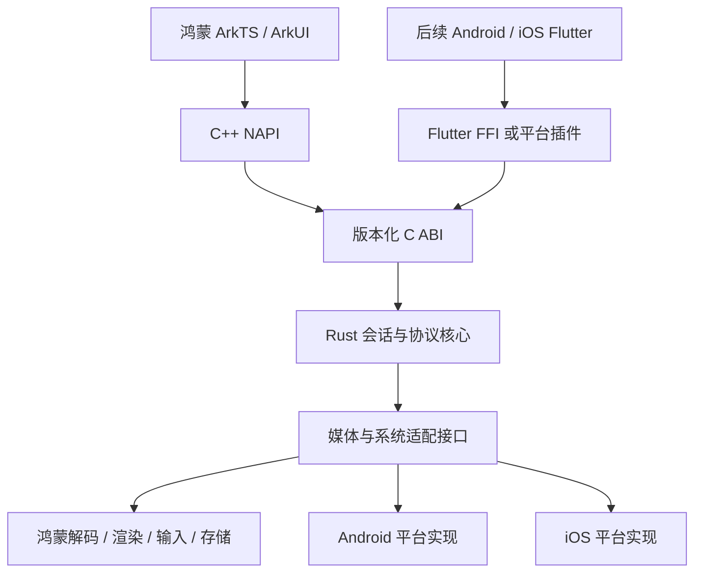

# SPEC-002：控制端技术栈决策

日期：2026-09-30。状态：鸿蒙原生优先、界面分端维护而核心共享的方向已获用户确认；具体构建依赖、媒体 API 与桥接实现仍需 M0 验证。

上位规格：[产品需求与架构](../SPEC.md)。源码复用依据：[控制端可移植性调查](../research/2026-09-30-controller-portability-audit.md)。本次只确定选型，不表示已构建出鸿蒙客户端。

2026-10-07 输入职责细化：共享范围新增手势识别、坐标归一化、滚轮余量、按键保持和确认文本分块，由同一 Rust 实现经 C ABI 提供。鸿蒙 NAPI 已接线，Flutter 适配覆盖后续 Android/iOS 与 Windows 控制端；当前跨语言验证在 Windows 完成，各平台实际交付边界见 [SPEC-004](004-cross-platform-input.md)。

## 1. 已确定的选择

**鸿蒙端采用 ArkTS + ArkUI，使用 C++ NAPI 连接版本化 C ABI，复用 RustDesk 的 Rust 会话/协议逻辑。视频显示、音频、输入法、安全存储和生命周期由各平台适配。**

用户已明确接受：鸿蒙与后续 iOS/Android 分别维护界面，以鸿蒙原生体验和稳定性优先。后续 Android/iOS 默认规划使用 Flutter 共享两端界面，并接入同一核心；进入该阶段时再锁定 Flutter 及原生插件版本。

共享目标是连接、认证、协议、会话状态与配置模型，不承诺 ArkUI 页面直接运行在其他系统，也不复制官方 RustDesk 核心让三端各自演化。

## 2. 技术选择与职责

| 层 | 选择 | 职责与边界 |
| --- | --- | --- |
| 鸿蒙应用 | ArkTS + ArkUI，Stage 模型 | 设备列表、连接页、会话工具栏、授权提示、手机/平板自适应 |
| UI 状态 | ArkUI 自带状态能力 + 分离的页面状态/业务服务 | UI 展示核心状态，不自己维护第二套认证和连接状态机；首期不引入额外状态框架 |
| ArkTS 原生桥 | C++ NAPI | 参数校验、异步命令、低频事件分发、原生资源绑定；保持薄层 |
| 稳定共享入口 | 版本化 C ABI | 不透明会话句柄、明确的数据/内存所有权、命令及事件；避免 UI 语言对象进入核心 |
| 会话与协议 | Rust + 当前 RustDesk 实现，保留其运行时管理方式 | ID/IP/中继连接、身份验证、登录、会话消息、能力与权限事件；不在 ArkTS 重写协议 |
| 视频 | 鸿蒙原生解码/渲染；软件解码作为验证或明确支持的兼容路径 | 原生线程处理帧，不经 ArkTS/JSON 逐帧搬像素；按设备真实能力协商编码，不默认软件回退一定可编译或可用 |
| 音频 | 鸿蒙原生音频适配，按权限后续开放 | 与视频同步、音频焦点和设备变化，不能假定播放接口可跨平台复用 |
| 存储 | 非敏感配置用平台存储；敏感凭据使用安全存储 Adapter | 不把密码/私钥放普通 Preferences、日志或跨设备明文同步 |
| 工具链 | DevEco Studio + 现有鸿蒙 6.1 SDK、Hvigor/ohpm、CMake、Rust/Cargo | M0 记录实际可用版本并锁定；先验证 ARM64 真机，不以模拟器代替 |
| 后续 Android/iOS | Flutter/Dart + 共享核心桥接 + 平台媒体/系统适配 | Android/iOS 共用界面代码；系统插件、解码、后台与签名分别实现 |

ArkTS 管界面、C++ 管系统桥接、Rust 管会话与协议；三种语言职责不同，不在三层重复实现同一功能。C++ 层不承担设备列表、账号流程等应用业务。

## 3. 核心调用关系

图表示最终复用方向，不要求先抽取整个 RustDesk 为新 SDK。第一阶段沿现有 `Client::start`、`Session<T: InvokeUiSession>` 评估鸿蒙 handler 和独立桥接，保持 Flutter 原路径。官方 `flutter_ffi` 依赖 Flutter 的事件/会话注册方式，鸿蒙不直接伪装成 Flutter。

## 4. 鸿蒙原生能力的接入

媒体 API 选择以本项目实际 SDK、文档最低 API 和真机能力为准；HarmonyOS 6.1 的产品版本号不直接替代 API level。

- **画面：** ArkUI 中提供原生显示区域，评估 XComponent/NativeWindow 相关接口；鸿蒙解码器输出与原生 Surface 对接，工具栏和输入层由 ArkUI 承担。
- **解码：** 使用鸿蒙官方原生视频解码能力作为性能路径；软件解码用于最初正确性验证及明确支持的回退。不能默认所有设备都支持 H.265/AV1 硬解。
- **输入：** 接收 ArkUI 触控、物理键鼠和输入法组合文本，映射为核心的语义输入；不把某一平台的 keycode 直接当成跨平台协议。
- **权限与安全：** 权限由被控端执行，控制端显示实时授权；本机凭据读取使用系统安全能力，不因“UI 是原生”就省略验证。
- **生命周期：** 页面退出、Surface 销毁、旋转、切后台和重连均有明确的资源停用/释放顺序；后台运行能力不作为永久在线保证。

首期不引入 WebView 承载远控画面，也不依赖 Flutter 鸿蒙适配层。若特定系统 API 不能满足实际要求，调整相应平台 Adapter，不为一个 API 重写共享协议核心。

## 5. 防止未来移植返工的约束

1. 共享核心只使用平台无关的数据和不透明资源句柄，不出现 ArkUI 页面、NAPI `napi_value`、JNI 或 Swift/Flutter 对象。
2. 按版本暴露少量命令：初始化、创建/连接/关闭、提交认证、输入、画质、能力与统计；旧版本不支持的命令明确失败。
3. 界面只观察状态；传输建立、身份校验、认证、现场批准、Active 和关闭完成是不同事件。
4. 网络与媒体不阻塞 UI 线程。回调经线程安全桥派发，不从已有 Tokio runtime 内嵌套创建 runtime。
5. 异步 buffer 必须有所有权，不能在回调后保留临时 Rust 指针；释放函数/retain-release 契约随 ABI 明确。
6. Surface 销毁前停止提交、注销回调并等待在途任务完成。旧 session generation 不能写入新页面或新 Surface。
7. 接口把“协议支持”“本地实现”和“会话授权”分开，避免未来把 VNC 或 RDP 的能力误当成 RustDesk 能力。
8. Android/iOS 增加平台实现时不复制核心源码；共享同一提交或明确版本的核心。不能用 Android/iOS stub 测试代替真机适配结果。

现有 Cargo 多处把非 Android/iOS 视为桌面平台。新增 OHOS 构建时必须核对这些条件及 Sciter、剪贴板、PTY、被控服务等依赖；只加一个目标三元组不能完成移植。

## 6. 首轮实现范围与顺序

| 顺序 | 目标 | 判断结果 |
| --- | --- | --- |
| T0 工具链 | 记录现有 DevEco/SDK、API、Rust/Cargo/CMake 和真机型号 | 锁定可重现环境；不预先升级全部依赖 |
| T1 最小原生链路 | ArkUI 按钮 → NAPI → Rust → 异步状态返回，重复创建与销毁 | 证明桥接、线程和打包可用 |
| T2 官方核心接入 | 逐项核对平台依赖，连接 Windows 并完成认证/批准 | 明确可复用边界，不误启动鸿蒙被控服务 |
| T3 单显示器 | 跑通一种可用解码、画面显示、基础鼠标键盘 | 校验坐标、首帧、断开、资源释放；安全要求沿主 SPEC |
| T4 原生体验 | 鸿蒙硬解、触控板/直接触控、中文输入、外接键鼠、旋转/恢复 | 用真机结果评价性能和稳定性 |
| T5 第二平台验证 | 后续新增 Android 或 iOS 最小适配 | 验证 ABI 与平台接口，再开始完整第二端 UI |

M1 仍要覆盖设备 ID、IP 直连和中继，不能以 T3 单链路跑通替代完整阶段验收。本规格不修改此前的认证、许可或公网发布要求。

## 7. 维护与许可

应用工程建议位于当前 fork 的 `apps/harmony/`；共享入口与平台适配留在明确模块中，具体文件由 M0 结果决定。先增量接入，不为了理论复用大规模重构上游，也不立即拆成多个核心仓库。

这个选择接受两套 UI 的维护成本，换取鸿蒙优先落地；协议、安全修复和会话行为尽量保持一份。后续 Flutter 只是 Android/iOS 界面方案，不要求鸿蒙再迁回 Flutter。

复用 RustDesk 的 AGPL 实现时相应许可义务仍适用。此次技术方向确认不等于用户已经确认最终商业开闭源策略；进入核心代码引入前按主 SPEC 的许可约束处理。

## 8. 鸿蒙官方依据与尚需验证的部分

2026-09-30 通过已配置华为知识 MCP 的标准 HTTP 接口调用 `searchDocuments`，再使用 `getDocumentsById` 读取以下三篇原文。当前会话未热加载专用工具，查询使用相同 MCP 服务；仅发送技术关键词，没有上传项目源码。三组文档调用返回 HTTP 200、业务 code=0。

| 官方文档 | 可以据此确认的能力 | 不能据此推定的结果 |
| --- | --- | --- |
| [使用 Node-API 接口进行线程安全开发](https://developer.huawei.com/consumer/cn/doc/harmonyos-guides/use-napi-thread-safety) | C++ 异步工作与线程安全函数能把结果投递到 ArkTS/JS 线程 | 文档直接证明 C++/ArkTS 桥接；Rust C ABI 的接入与官方依赖交叉编译仍是本项目工作 |
| [自定义渲染 XComponent](https://developer.huawei.com/consumer/cn/doc/harmonyos-guides/napi-xcomponent-guidelines) | 原生显示可通过 Surface/NativeWindow 承接渲染，销毁后继续使用对象有风险 | 当前文档推荐路径和每项新 API 不一定全部适用于项目实际 6.1 SDK；手势也不会自动完成远控映射 |
| [视频解码](https://developer.huawei.com/consumer/cn/doc/harmonyos-guides/video-decoding) | Surface 模式对接 NativeWindow，支持查询解码能力；按 MIME 创建不保证使用硬解 | 不能承诺特定设备/编码格式已支持，不能把任意 RustDesk 网络包直接作为解码输入 |

平台 VideoDecoder 适配要处理编码帧边界与格式：对这里讨论的 H.264/H.265 路径，按官方文档的 Annex B 输入和同帧多个 slice 一次提交要求核对实际 RustDesk 输出，在确有不匹配时转换。该字节格式要求不套用到 VP9/AV1 等其他编码。不能把视频通道抽象成无语义的字节透传。

官方文档要求在 Prepare 前设置 Surface。刷新、停止或重建后按协商格式和 SDK 状态机重新提供 codec 配置：H.264 包括 SPS/PPS，H.265 包括 VPS/SPS/PPS；Reset 后还需按状态机重新配置、绑定 Surface、Prepare，再启动，不能只再次调用 Start。Flush/Reset/Stop/Destroy 在非回调线程调用，旧 OH_AVBuffer 在被回收后不可复用。这些规则纳入断开、旋转、重连和解码重建验收。

优先评估真机可用的 H.264 原生路径；没有对应硬解或格式条件时，切换到已验证的兼容路径或明确失败。文档为知识服务当前版本，不是锁定的 HarmonyOS 6.1 快照；API level、SurfaceHolder 等具体接口和硬件支持在 M0/T0 锁定，不能仅凭最新资料声明已兼容。
